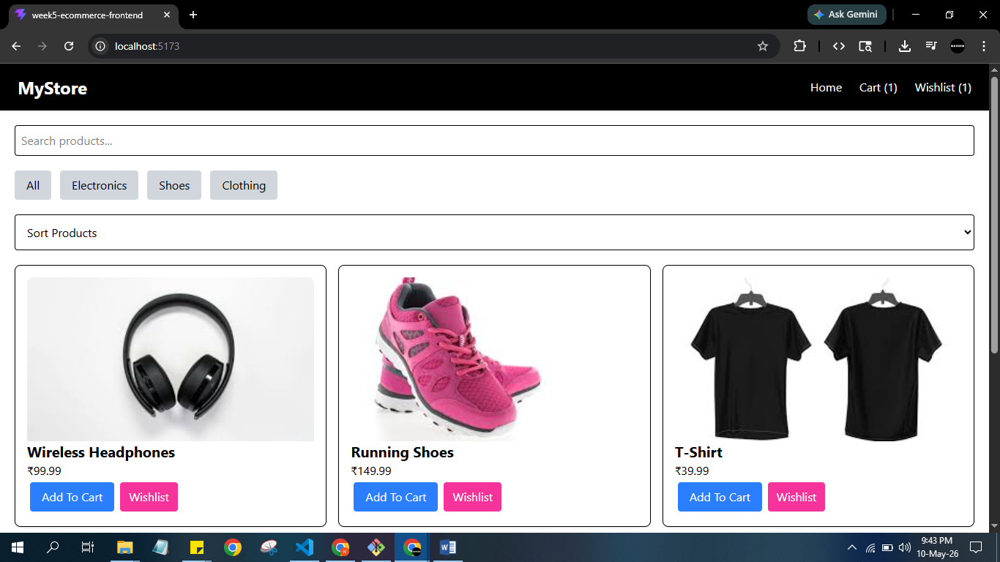
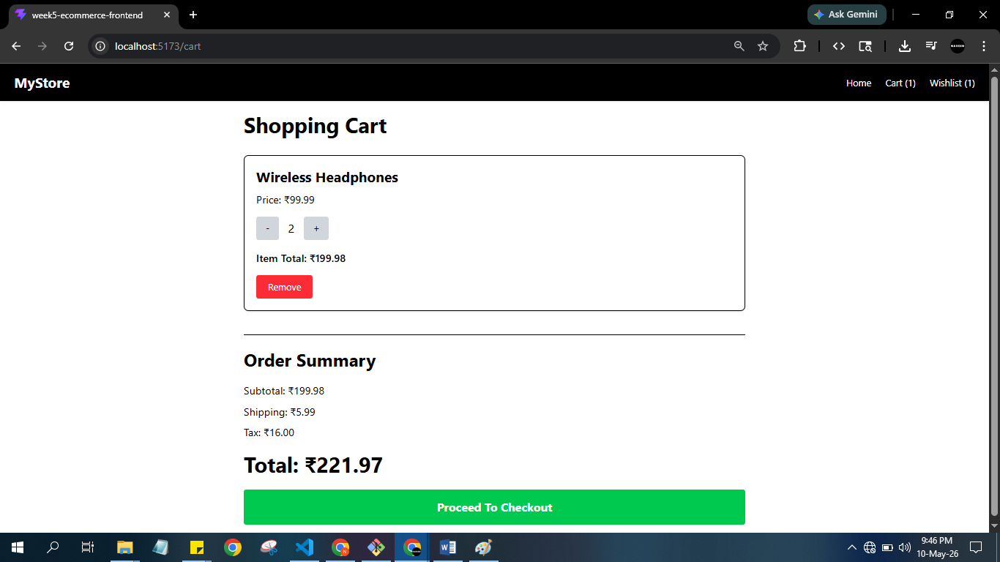
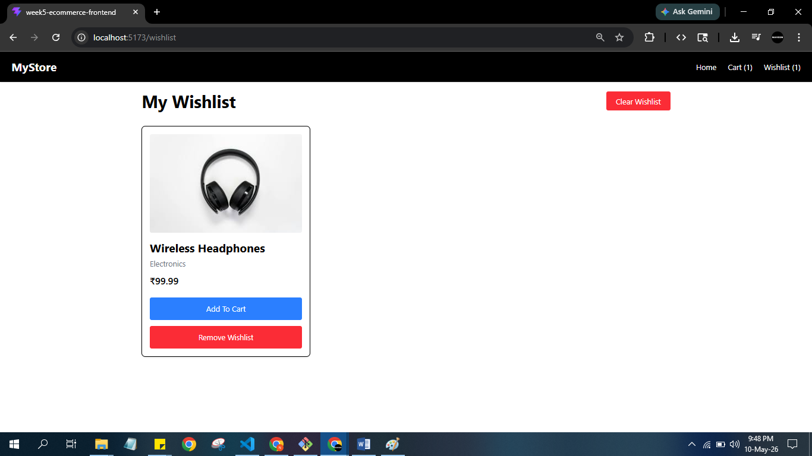
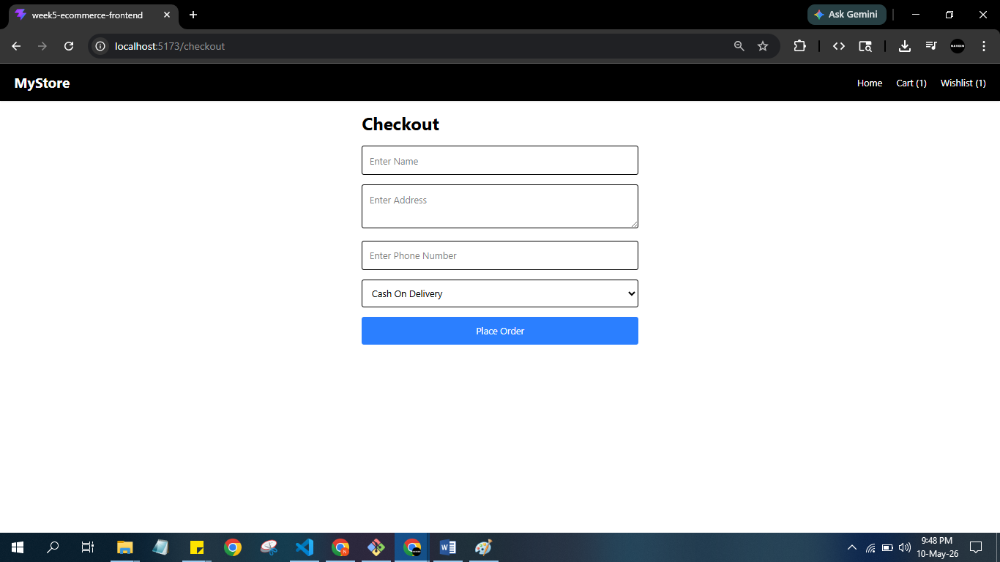

# Advanced E-commerce Frontend

A modern e-commerce frontend built using React, Redux Toolkit, React Router, and Tailwind CSS.

---

# Live Demo

[https://week5-ecommerce-frontend.vercel.app/](https://week5-ecommerce-frontend.vercel.app/)

# Features

- Product Listing
- Product Search
- Category Filtering
- Product Sorting
- Wishlist Functionality
- Shopping Cart
- Quantity Update
- Checkout Page
- Responsive Design
- localStorage Persistence
- Lazy Loading

---

# Technologies Used

- React 18
- Redux Toolkit
- React Router DOM
- Tailwind CSS
- Vite
- localStorage

---

# screenshots

